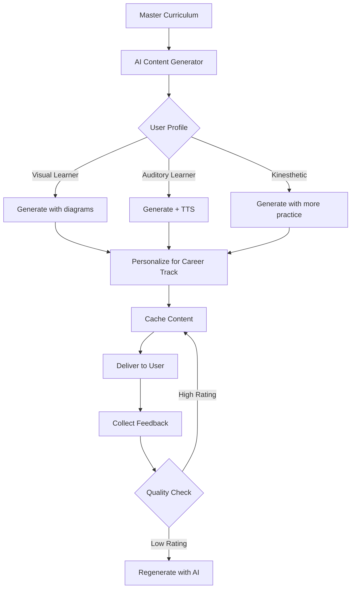

AI-generated контент — это мощный подход, который позволит масштабироваться быстро. Давай детально распишу как построить всю контентную часть на AI:

***

# AI-Generated Content Strategy

## 1. Архитектура генерации контента

### Контентная база данных (Content Engine)

**Структура:**

```
Quest/Lesson {
  id, title, difficulty_level, track, subtrack,
  learning_objectives: [],
  prerequisites: [],
  estimated_time,
  content_blocks: [
    {type: "theory", style_variants: {visual, auditory, kinesthetic}},
    {type: "example", context: user_career_track},
    {type: "practice", difficulty: adaptive},
    {type: "evaluation", criteria: []}
  ]
}
```


### AI Content Generation Pipeline

**Phase 1: Curriculum Design (делается один раз, вручную)**

Ты создаёшь **Master Prompt Template** для каждого track/subtrack:

- Learning objectives (что должен уметь после курса)
- Key concepts (список тем для покрытия)
- Practical outcomes (что сможет создать)
- Difficulty progression (от простого к сложному)

**Phase 2: Automated Content Generation**

Claude/GPT генерирует детальный контент на основе templates.[^1][^2]

**Пример промпта для генерации урока:**

```
Role: Expert AI educator specializing in {track_name}
Task: Create a comprehensive lesson for {lesson_topic}

Context:
- User level: {beginner/intermediate/advanced}
- Learning style: {visual/auditory/kinesthetic}
- Career track: {freelancer/entrepreneur/career_growth}
- Time available: {15min/30min/1hour}

Generate:
1. Theory block (2-3 paragraphs, {style}-optimized)
2. Real-world example relevant to {career_track}
3. Step-by-step practical exercise
4. Common mistakes to avoid
5. Success criteria for evaluation
6. 3 follow-up micro-challenges

Format: JSON structure matching our content schema
```


***

## 2. Адаптация контента под стили обучения

### Visual Learners (без видео)

**AI генерирует:**

- **Mermaid diagrams** (автоматически встраиваются как код):

```
Claude → "Создай flowchart для процесса создания промпта"
→ Mermaid syntax → рендерится на фронте
```

- **ASCII art / Unicode diagrams** для простых концептов:

```
Prompt Structure:
┌─────────────────┐
│   Context       │ ← Background info
├─────────────────┤
│   Task          │ ← What to do
├─────────────────┤
│   Examples      │ ← Show, don't tell
├─────────────────┤
│   Constraints   │ ← Format, length
└─────────────────┘
```

- **Markdown tables** для сравнений, чек-листов
- **Highlighted code blocks** с annotations
- **Before/After comparisons** (плохой промпт vs хороший)
- **Step-by-step screenshots** (пользователи загружают, AI анализирует и создаёт tutorials на их основе — community-driven content)

**AI-generated визуальные элементы:**

- **Инфографика через text-to-image**: используешь Stable Diffusion API для генерации иллюстраций

```
Prompt: "Minimal infographic showing 3 steps of prompt engineering, 
clean design, educational style, white background"
```

- **Icon generation** для badges, achievements (DALL-E 3 / SD)


### Auditory Learners (без видео, но с аудио)

**Text-to-Speech интеграция:**

**Варианты TTS:**

1. **ElevenLabs API** (лучшее качество, \$22-99/мес):
    - Реалистичные голоса, поддержка русского/английского
    - Можно создать custom voice brand для платформы
    - ~\$0.30 за 1000 символов[^3]
2. **Google Cloud TTS** (дешевле, \$4/1M символов):
    - Хорошее качество, много языков
    - WaveNet voices звучат естественно
3. **OpenAI TTS API** (средний вариант, \$15/1M символов):
    - 6 голосов на выбор
    - Интеграция с твоим существующим OpenAI setup

**Реализация:**

- AI генерирует текст урока → автоматически конвертируется в аудио → кэшируется
- Пользователь видит кнопку 🔊 "Listen to this lesson"
- Можно регулировать скорость воспроизведения (0.75x - 1.5x)
- Offline mode: скачивание аудио-версии уроков (premium feature)

**Подкаст-стиль контент:**

- AI генерирует "диалоги" между учителем и студентом (два разных TTS-голоса)
- Формат: вопрос-ответ, более engaging чем монотонный текст
- Пример:

```
Teacher (Voice A): "Почему этот промпт не работает?"
Student (Voice B): "Наверное, не хватает контекста?"
Teacher: "Точно! Давай разберём..."
```


### Kinesthetic Learners (максимум практики)

**AI-generated практические задания:**

**Interactive Coding Challenges:**

- AI генерирует задачу → предоставляет starter code → проверяет решение
- Пример: "Создай промпт для генерации React компонента кнопки"
- Встроенный code editor (Monaco Editor, как в VS Code)
- Live preview результата

**Sandbox Environments:**

- **Prompt Playground**: текстовое поле для промпта → live результат от API
- **Automation Builder**: drag-and-drop blocks для n8n-style workflows (генерируется AI)
- **Mini-projects**: "Создай landing page за 30 минут используя v0.dev" — step-by-step guide генерируется AI

**Gamified Challenges:**

- AI генерирует рандомные челленджи: "Сгенерируй изображение кота в стиле киберпанк за 3 попытки"
- Scoring system на основе качества результата (AI оценивает)

***

## 3. Персонализация под карьерные треки

### AI Context Injection

Один и тот же урок, но с разными примерами:[^4][^5]

**Базовый урок: "Prompt Engineering Basics"**

**Для Freelancer Track:**

```
AI Prompt:
"Rewrite this lesson with examples relevant to freelance work:
- Client communication scenarios
- Portfolio piece creation
- Fast turnaround optimization
- Monetization angles"

Output:
"Представь, клиент просит логотип за 2 часа. Как промпт в Midjourney 
поможет выдать 10 вариантов быстро?..."
```

**Для Entrepreneur Track:**

```
"Same lesson but with startup/business automation examples:
- Customer support automation
- Lead generation
- Product ideation
- Scaling operations"

Output:
"Ты запускаешь SaaS. Нужен FAQ-бот. Как структурировать промпт 
для создания AI-ассистента?..."
```

**Для Career Growth Track:**

```
"Rewrite with corporate/job-related examples:
- Improving daily workflows
- Presentation creation
- Data analysis
- Impressing your boss"

Output:
"Твой менеджер просит аналитический отчет. Как использовать AI 
для обработки данных за 15 минут?..."
```


### Dynamic Example Generation

AI генерирует примеры в реальном времени на основе:

- User's industry (если указал в профиле)
- Previous projects (контекст из portfolio)
- Current trends (AI читает последние новости/кейсы)

***

## 4. Оценка и фидбек (AI-powered)

### Автоматическая проверка заданий

**Text-based задания:**

**Prompt Quality Assessment** (AI проверяет промпты):

```python
# Pseudo-code примера

def evaluate_prompt(user_prompt, task_requirements):
    evaluation_prompt = f"""
    Role: Expert prompt engineer
    
    Task: Evaluate this user's prompt for quality
    
    User prompt: {user_prompt}
    Requirements: {task_requirements}
    
    Assess on 5 criteria (score 0-10 each):
    1. Clarity: Is the instruction clear?
    2. Specificity: Are details provided?
    3. Context: Is background info included?
    4. Constraints: Are format/length specified?
    5. Examples: Are examples/references given?
    
    Provide:
    - Scores for each criterion
    - Overall score (0-100)
    - 2-3 specific improvements
    - Rewritten "improved" version
    
    Format: JSON
    """
    
    response = claude.generate(evaluation_prompt)
    return parse_json(response)
```

**Code Review** (для vibe coding заданий):

```python
def review_code(user_code, lesson_objectives):
    review_prompt = f"""
    Review this code for a {lesson_objectives} task:
    
    {user_code}
    
    Check:
    - Correctness: Does it work?
    - Best practices: Clean code?
    - AI usage: Did they use AI effectively?
    - Learning goals: Met objectives?
    
    Provide constructive feedback + suggestions
    """
    
    return claude.generate(review_prompt)
```

**Image/Screenshot Analysis:**

Для заданий где пользователь загружает результат (Midjourney, презентация и т.д.):

```python
def evaluate_visual_result(image_url, task_description):
    evaluation_prompt = f"""
    Analyze this image submitted for task: {task_description}
    
    Image URL: {image_url}
    
    Evaluate:
    - Task completion: Does it match requirements?
    - Quality: Is it professional/polished?
    - Creativity: Is there originality?
    - Technical execution: Proper use of tools?
    
    Score 0-100 + detailed feedback
    """
    
    # Claude Vision API
    return claude_vision.analyze(image_url, evaluation_prompt)
```


### Adaptive Hints System

Если пользователь застрял на задании:

**Progressive Hint Generation:**

```
1. User attempts task → fails
2. System: "Need a hint?" (не показывает автоматически)
3. User clicks → AI generates subtle hint based on their attempt:
   
   AI Prompt:
   "User tried: {their_attempt}
   Task: {task_description}
   Generate a subtle hint that guides without giving the answer.
   Focus on what they missed, not the full solution."

4. If still stuck → offer more direct hint
5. After 3 attempts → show example solution + explanation
```


***

## 5. Continuous Content Improvement

### Community-Driven Enhancement

**Feedback Loop:**

- User completes lesson → rates difficulty (too easy/just right/too hard)
- AI analyzes patterns: "80% find this lesson too hard" → auto-adjusts content
- Regenerates section with simpler explanations

**A/B Testing Content:**

- AI генерирует 2-3 версии одного урока
- Разные пользователи получают разные версии
- Система трекает: completion rate, time spent, user rating
- Лучшая версия становится default[^4]


### Real-time Content Updates

**News \& Trends Integration:**

```python
# Scheduled job (runs weekly)

def update_content_with_trends():
    """
    AI читает последние AI news/updates
    Автоматически добавляет в relevant lessons:
    - "🆕 Update: GPT-5 released with new features..."
    - "💡 New technique: Try this advanced prompt pattern..."
    """
    
    latest_news = fetch_ai_news_apis()
    
    for lesson in get_relevant_lessons():
        update_prompt = f"""
        Current lesson content: {lesson.content}
        Recent news: {latest_news}
        
        Add a brief "What's New" section if relevant.
        Keep it under 100 words, actionable.
        """
        
        updated = claude.generate(update_prompt)
        lesson.add_update_section(updated)
```


***

## 6. Контентная структура (без видео)

### Формат уроков

**Каждый урок состоит из:**

1. **📖 Theory (5-10 мин чтения/аудио)**
    - AI-generated текст
    - Diagrams (Mermaid)
    - Key takeaways (bullets)
    - 🔊 Audio version (TTS)
2. **💡 Real-World Example (3-5 мин)**
    - Case study (персонализированный под career track)
    - Before/After сравнение
    - Breakdown объяснения почему работает
3. **🛠️ Hands-On Practice (10-30 мин)**
    - Interactive задание
    - Step-by-step instructions (generated by AI)
    - Sandbox/playground если возможно
    - Submit результата
4. **✅ AI Review \& Feedback (instant)**
    - Автоматическая оценка
    - Detailed feedback
    - Suggestions for improvement
    - XP reward
5. **🚀 Next Steps**
    - Related quests unlock
    - Optional: advanced challenges
    - Community projects to check out

### Типы контента (все AI-generated)

**Text-based:**

- Articles, tutorials, guides
- Checklists, templates
- Code snippets with annotations
- Prompt libraries

**Visual (без видео):**

- Infographics (AI-generated images)
- Diagrams (Mermaid, ASCII)
- Screenshots with annotations (community + AI)
- Comparison tables

**Audio:**

- Text-to-speech уроки
- Podcast-style dialogues
- Audio summaries (ключевые моменты за 2 мин)

**Interactive:**

- Quizzes (AI-generated вопросы)
- Code challenges
- Prompt playgrounds
- Simulation exercises

***

## 7. Технический Pipeline для генерации

### Content Generation Workflow




### Database Schema (упрощённо)

```sql
-- Контент генерируется один раз, кэшируется, варьируется

content_templates (
  id, track, subtrack, lesson_number,
  base_learning_objectives,
  difficulty_level,
  estimated_time
)

generated_content_variants (
  id, template_id,
  learning_style, -- visual/auditory/kinesthetic
  career_track, -- freelancer/entrepreneur/career
  content_json, -- фактический контент
  audio_url, -- если TTS сгенерирован
  generated_at,
  performance_score -- на основе user feedback
)

user_content_cache (
  user_id, content_variant_id,
  personalized_examples, -- AI добавляет контекст юзера
  cached_at
)
```


### Cost Optimization

**Генерация контента — дорого. Стратегии экономии:**

1. **Pre-generation основного контента:**
    - Генерируешь 3 варианта каждого урока (visual/auditory/kinesthetic)
    - Кэшируешь навсегда
    - Стоимость: ~\$500-1000 одноразово для всего курса
2. **On-demand персонализация:**
    - Базовый контент из кэша
    - AI добавляет только персонализированные примеры (~\$0.01 per user)
3. **Batch generation:**
    - Генерируешь контент ночью (off-peak)
    - Используешь более дешёвые модели для non-critical content
4. **User-generated content дополняет:**
    - Лучшие work примеры пользователей становятся case studies
    - Community Q\&A дополняет AI-контент
    - AI суммаризирует и структурирует community input

***

## 8. MVP Content Plan

### Phase 1: Foundation (можно сгенерировать за 1-2 недели)

**Foundation Level — 10 уроков:**

1. What is AI \& LLMs
2. Prompt Engineering Basics
3. Understanding Models (GPT, Claude, etc)
4. Prompt Structure \& Best Practices
5. Iteration \& Refinement
6. Common Mistakes \& How to Fix
7. Prompt Templates \& Libraries
8. AI Tool Landscape
9. Ethics \& Responsible AI Use
10. **Boss Quest**: Build Your First AI Workflow

**Генерация:**

- Пишешь мастер-промпт для каждого урока
- Claude генерирует 3 версии (styles) × 3 треки = 9 вариантов каждого
- TTS для audio версий
- Общая стоимость: ~\$200-300 в API costs


### Phase 2: Специализации (2-3 недели на track)

**Каждый track — 20-30 уроков:**

- Content Creation: 25 уроков
- Automation: 25 уроков
- Development: 30 уроков

**Итого:** ~80 уроков × 9 вариантов = 720 контентных единиц
**AI generation cost:** ~\$800-1200
**Время:** 6-8 недель если автоматизировать процесс

### Phase 3: Advanced Content (continuous)

После MVP — добавляешь:

- Weekly новые micro-quests (AI генерирует на основе трендов)
- User-requested topics (community voting → AI создаёт урок)
- Seasonal challenges

***


